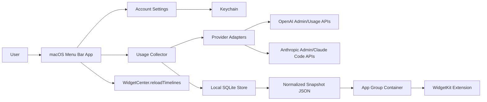

# 아키텍처

## 결론

1차 구현은 네이티브 Swift 앱으로 진행합니다.

- macOS App: SwiftUI 메뉴바 앱
- Widget: WidgetKit
- 비밀 저장소: Keychain
- 공유 캐시: App Group 컨테이너
- 로컬 저장소: SQLite, SwiftData 또는 GRDB
- 네트워크: URLSession 기반 provider adapter
- 공용 도메인 모델: Swift Package로 분리

## 구조



## 모듈

### App

설정, 인증 상태 확인, 수동 갱신, 메뉴바 팝오버, 온보딩을 담당합니다.

### Collector

백그라운드 수집 루프입니다. 계정별 polling interval, retry, rate limit backoff, stale data 판정을 처리합니다.

macOS에서는 앱 실행 중 더 자주 갱신할 수 있고, 앱 종료 상태에서는 LaunchAgent 또는 BackgroundTasks 사용을 검토합니다. MVP에서는 메뉴바 앱 상주를 기본 전제로 둡니다.

### ProviderAdapters

공급자별 API 차이를 숨기는 계층입니다.

```swift
protocol UsageProviderAdapter {
    var provider: ProviderKind { get }
    func validateCredential(_ credentialRef: CredentialRef) async throws -> ProviderIdentity
    func fetchUsage(account: Account, range: UsageRange) async throws -> UsageSnapshot
}
```

### Store

정규화된 사용량과 원본 응답 메타데이터를 저장합니다. Widget extension은 Keychain이나 외부 API에 접근하지 않고 App Group의 snapshot만 읽습니다.

### Widget

Widget은 표시 전용입니다.

- 네트워크 요청 없음
- 비밀값 접근 없음
- 캐시 스냅샷 읽기
- timeline refresh는 OS 정책을 따른다

## "실시간" 정의

WidgetKit 위젯은 상시 실행 UI가 아니므로 초 단위 실시간을 보장하지 않습니다. 제품상 실시간은 두 계층으로 나눕니다.

- 메뉴바 앱: 1-5분 단위 갱신, 수동 갱신 지원
- 위젯: 최신 스냅샷 표시, OS가 허용하는 범위에서 timeline reload 요청

초 단위 상태가 필요한 경우 위젯이 아니라 메뉴바 팝오버를 주 화면으로 봅니다.

## 모바일 확장

iOS 위젯은 백그라운드 수집 제약이 더 크므로 두 가지 경로를 열어둡니다.

1. iCloud Private Database 동기화
   - macOS 앱이 수집한 snapshot을 iCloud에 저장
   - iOS 앱/위젯은 snapshot만 읽음
   - 개인 사용에 적합

2. 서버 수집기
   - provider credentials를 서버 또는 사용자 조직의 secret store에 보관
   - macOS/iOS는 API 서버에서 정규화 snapshot을 받음
   - 팀/조직 사용에 적합

MVP는 로컬 우선으로 만들되, `UsageSnapshot` 형식은 네트워크 동기화에 그대로 사용할 수 있게 버전 필드를 둡니다.

모바일 확장은 MVP 이후입니다. MVP에서는 iCloud, 서버 수집기, 로컬 로그/OTel 수집기를 구현하지 않습니다.

## 보안 원칙

- API key, admin key, access token은 Keychain에만 저장합니다.
- App Group에는 사용량 snapshot과 비식별 account alias만 저장합니다.
- 원본 API 응답은 기본적으로 저장하지 않고, 디버그 모드에서만 민감 필드를 제거해 저장합니다.
- 비공식 웹 스크래핑이나 브라우저 쿠키 접근은 하지 않습니다.
- WebView 로그인, browser cookie/localStorage import, 다른 앱의 OAuth token 재사용, Full Disk Access가 필요한 자동 스캔은 MVP에서 제외합니다.
- 계정 삭제 시 Keychain item, snapshot, 로컬 history를 함께 제거합니다.

## 장애 처리

수집 실패는 숫자를 0으로 대체하지 않습니다.

- `auth_failed`: 키 만료, 권한 부족, 로그인 필요
- `permission_denied`: admin scope 또는 workspace 권한 부족
- `unsupported`: 해당 플랜/인증 방식에서 조회 API 없음
- `rate_limited`: provider rate limit
- `stale`: 마지막 성공 시각이 freshness SLA 초과
- `partial`: 일부 metric만 수집됨
